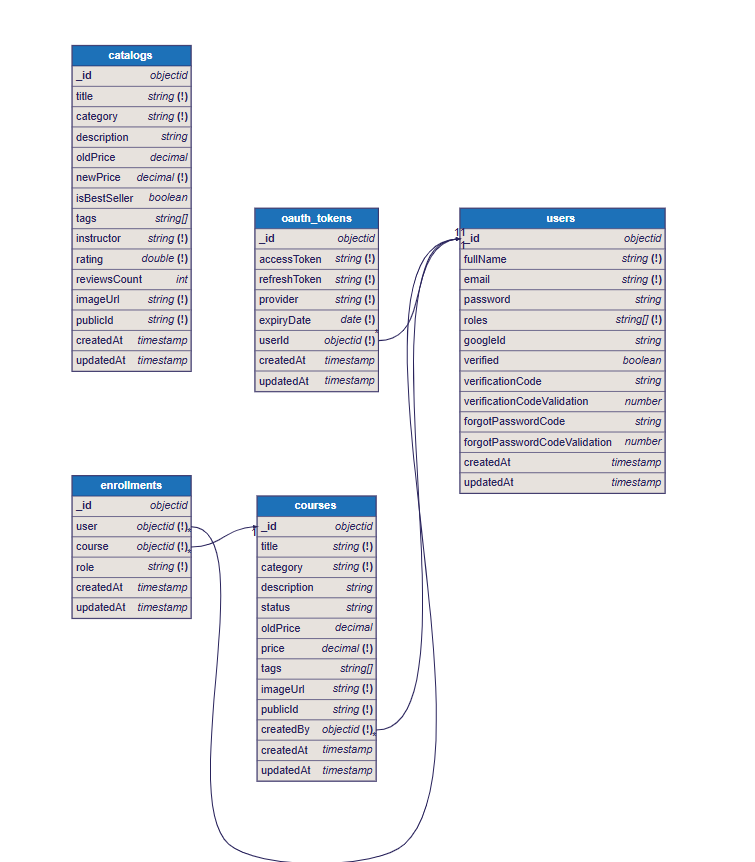

## Youdemi Backend
#### The backend code for the Youdemi Full-Stack Application

### made by Emmanuel Mojiboye (Dynasty)

## Technologies Used
* _Git_
* _NodeJS_
* _Render_
* _JavaScript_
* _Cloudinary_

## Entity-Relationship Diagram (ERD)

_This is the current picture of the database schema as at 29/08/2026. Time: 18:32 UTC+1 (Nigerian Time)_

## APIs documentation
_https://documenter.getpostman.com/view/24120041/2sB3BAKrYj_

## License 
ISC

## Contact
Dynasty